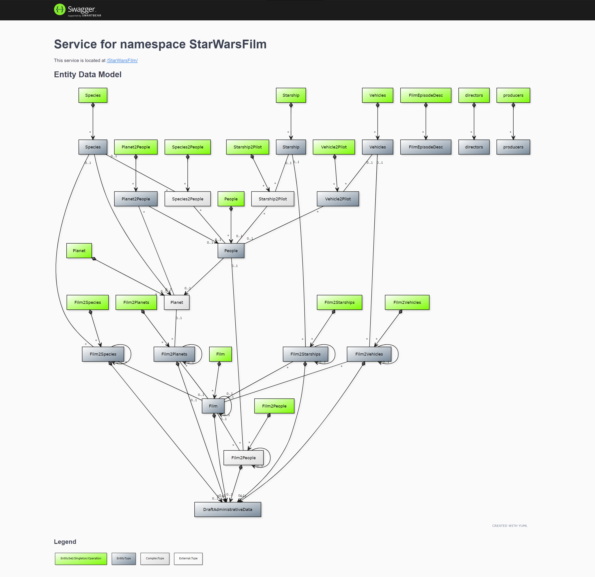
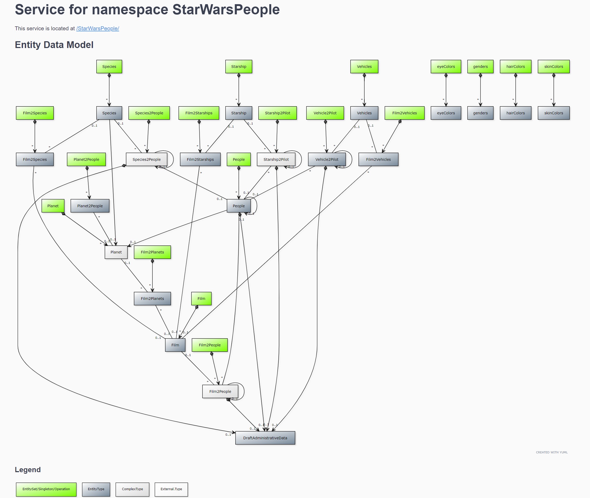
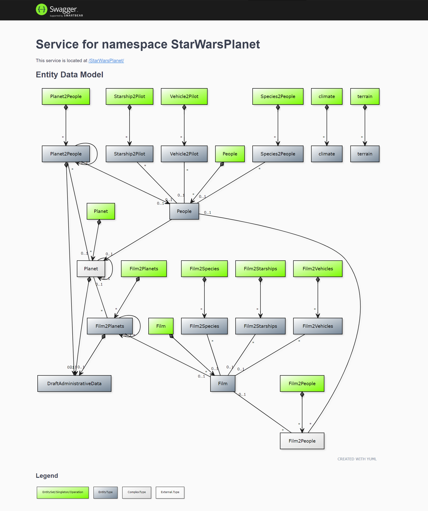
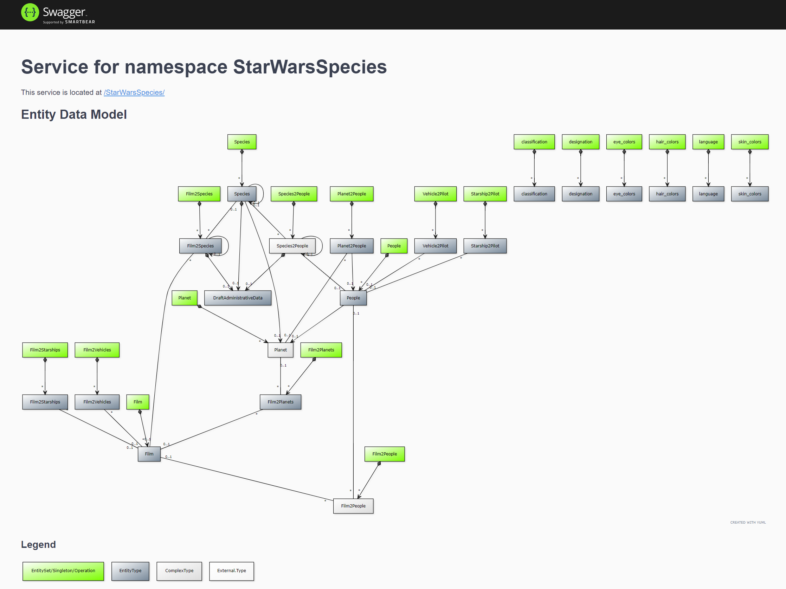
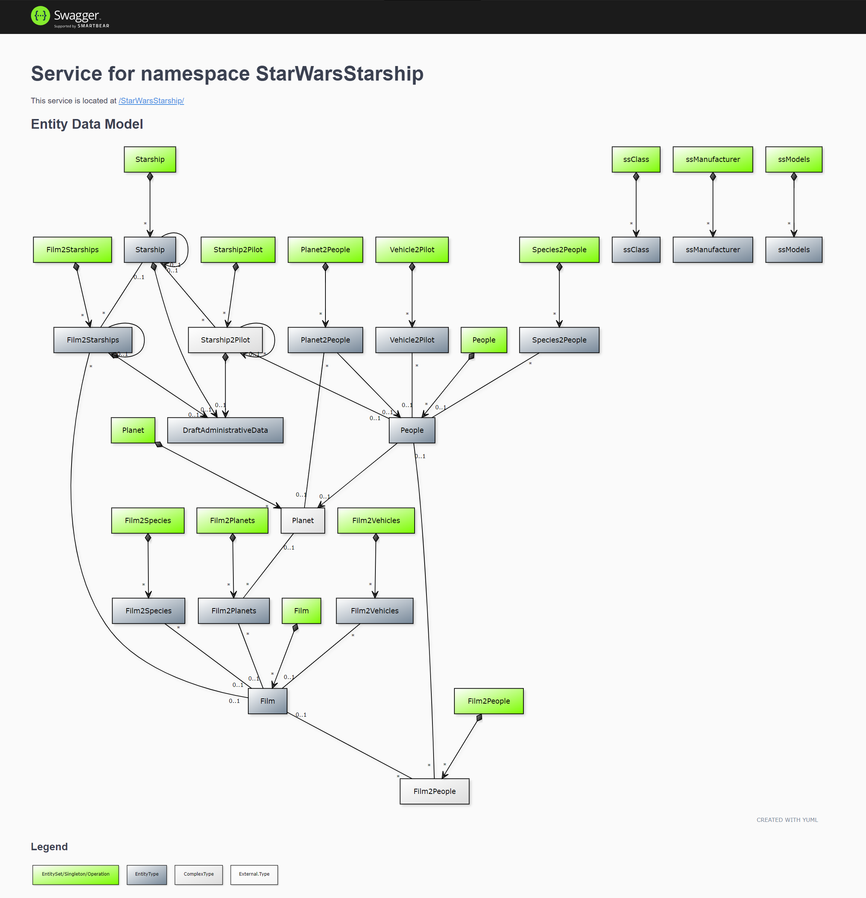
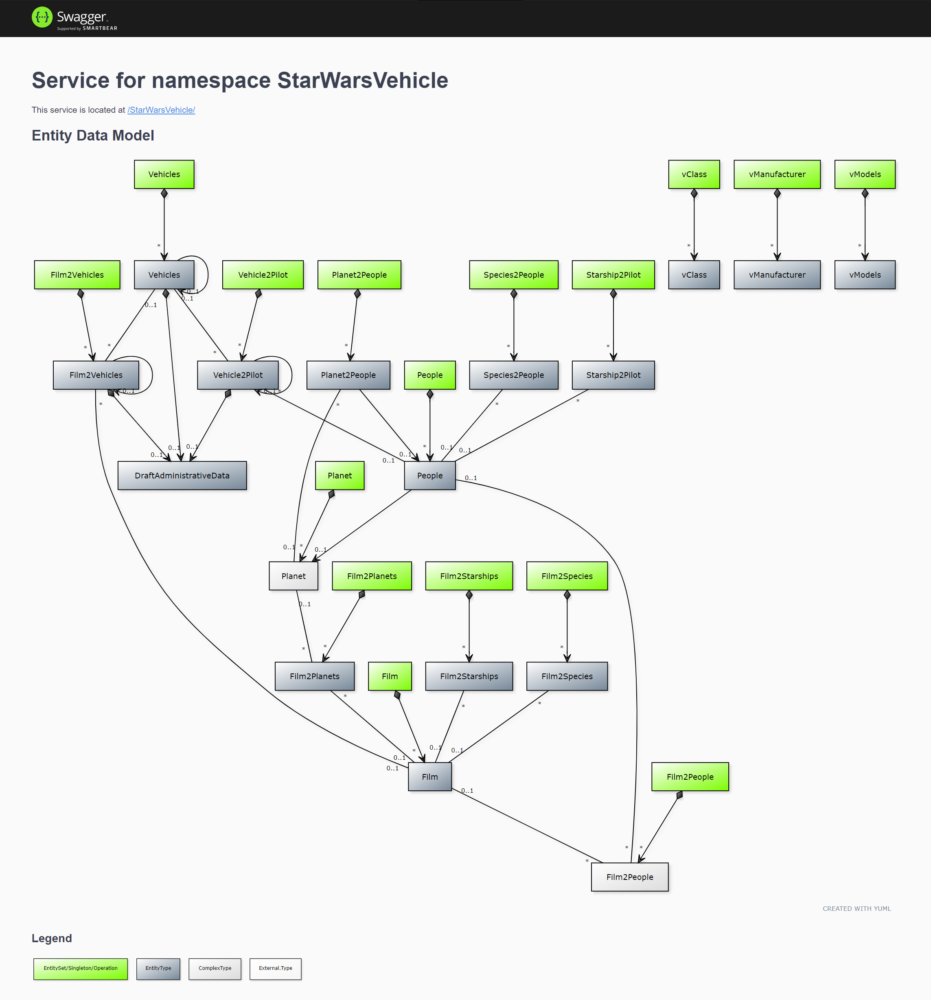
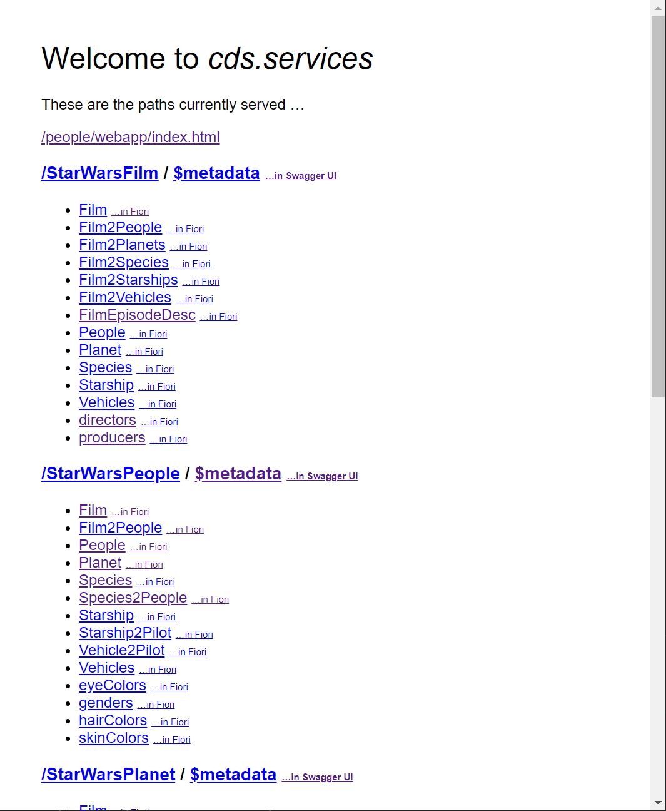
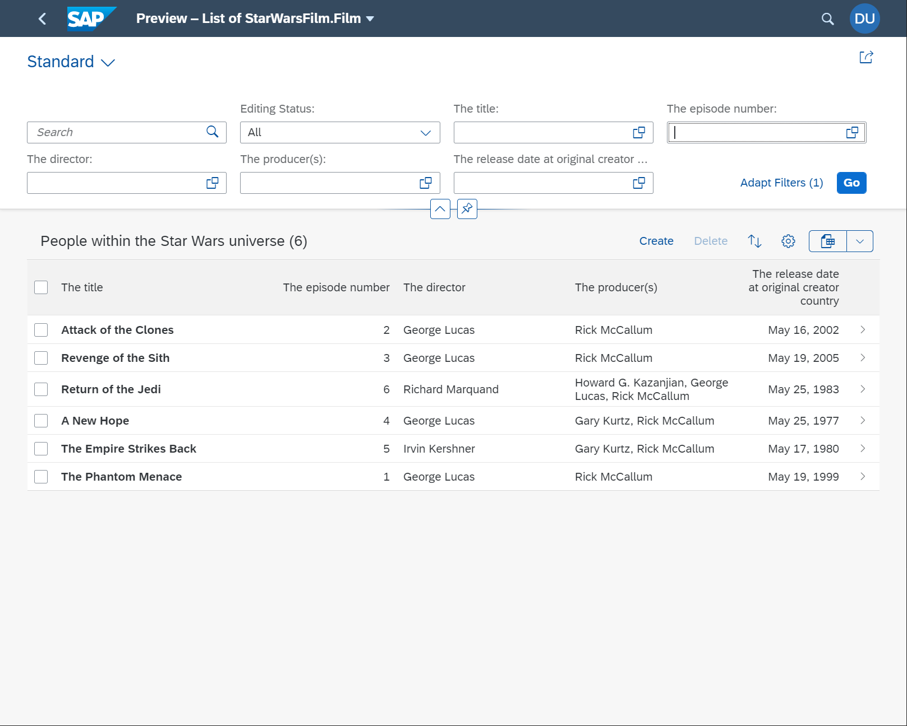
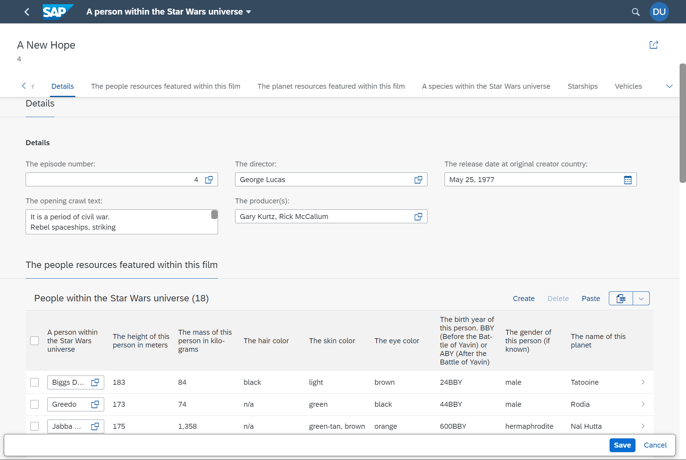

# cloud-cap-hana-swapi - bi-directional, many-to-many SAP Cloud Application Programming Model example

[](https://api.reuse.software/info/github.com/SAP-samples/cloud-cap-hana-swapi)

## Description

SWAPI - the Star Wars API. This sample is based upon the sample at [swapi.dev](https://swapi.dev/) which in turn was based upon [swapi.co](https://swapi.dev/about). The original source can be found at [https://github.com/Juriy/swapi](https://github.com/Juriy/swapi).

The original project was a data set and data model based in Python that exposed data from the Star Wars movies sourced originally from the community wiki: [Wookiepedia](https://starwars.fandom.com/wiki/Wookieepedia). It encompasses data about the People, Films, Species, Starships, Vehicles and Planets from Star Wars.

The projects described above have fallen out of maintenance but still offered the opportunity for a fun yet challenging learning experience from a non-trivial data model. The many bi-directional, many-to-many relationships with the data provides a good basis for an SAP Cloud Application Programming Model and Fiori Draft UI sample.

This project extends the original data set with **TV Shows and streaming series** (The Mandalorian, The Clone Wars, Andor, etc.) scraped live from Wookieepedia, and introduces unified `Media` views that query across both films and shows.

### Data Model

#### Films



#### Shows (TV Series & Streaming)

The `Show` entity represents all canon Star Wars TV and streaming productions. It shares the same relationship structure as `Film` — each show can be linked to characters, planets, starships, vehicles, and species.

| Field | Type | Notes |
| --- | --- | --- |
| `title` | String | `@mandatory` |
| `show_type` | Enum | `LIVE_ACTION_SERIES`, `ANIMATED_SERIES`, `ANIMATED_FILM`, `ANTHOLOGY` |
| `seasons` | Integer | Number of seasons |
| `episode_count` | Integer | Total episode count |
| `network` | String | Broadcaster / streaming platform |
| `director` | String | Lead director(s) |
| `producer` | String | Lead producer(s) |
| `release_date` | Date | First air date |

Each show owns a composition of `Episode` records (cascade-delete). The `Episode` entity captures per-episode metadata: `season_number`, `episode_number`, `title`, `air_date`, `director`, `writer`, `runtime` (minutes), and `timeline` (in-universe date, e.g. "19 BBY").

Junction tables: `Show2People` (physical), `Episode2People`, `Episode2Planets`, `Episode2Starships`, `Episode2Vehicles`, `Episode2Species`

`Show2Planets`, `Show2Starships`, `Show2Vehicles`, and `Show2Species` are **CDS `define view`** declarations that aggregate over the corresponding `Episode2*` tables. They are not physical tables — show-level relationship data is derived from episode-level scraping.

#### Unified Media Views

Six read-only `UNION ALL` views join `Film` and `Show` data across a single query surface. The relationship views each include a branch for `Episode2*` data so that episode-level associations are surfaced at the media level:

| View | Returns |
| --- | --- |
| `Media` | All films and shows with a `media_type` discriminator (`'FILM'` / `'SHOW'`) |
| `MediaCharacters` | All film+show+episode → character relationships |
| `MediaPlanets` | All film+show+episode → planet relationships |
| `MediaSpecies` | All film+show+episode → species relationships |
| `MediaStarships` | All film+show+episode → starship relationships |
| `MediaVehicles` | All film+show+episode → vehicle relationships |

#### People



#### Planets



#### Species



#### Starships



#### Vehicles



## Requirements

* [SAP Cloud Application Programming June 2023 (7.0) or higher](https://cap.cloud.sap/docs/releases/july21)
* [Node.js 16, 18, or 20](https://nodejs.org/en/)

## Download and Installation

The rest of the operations can be performed within the [cap](./cap/) folder and there are scripts in the [package.json](./cap/package.json#L20) file for major operations.

You can use `npm run build` to perform the cds build and should be run before deployment to HANA or whenever you make changes to the data model.

You can run `npm run hana` to deploy the content to your HANA database. Just be sure from the terminal that you are logged into the cf/xs cli and targeting the Account/Org/Space where you want the content to live. By default this command will create an HDI Container instance named **starwars**. **Note**: due to some strange circumstances in the latest versions of CAP it seems the `/gen/srv` folder is getting cleared after any deployment to HANA. Therefore just execute a `cds build` or `npm run build` after any deployment to restore the `/gen` folder until we find the root cause of this issue.

### Data Pipeline

Star Wars data is sourced from [Wookieepedia](https://starwars.fandom.com/wiki/Wookieepedia) via a rate-limited MediaWiki API scraper. The pipeline is two steps:

**Step 1 — Scrape** (optional — committed cache makes this instantaneous):

```bash
cd cap
npm run scrape              # cache-first run — uses committed cache, completes in seconds
npm run scrape:films        # films-only run (no episodes); reproduces the original SWAPI dataset
npm run scrape:bypass-cache # fetch fresh data from Wookieepedia (prompts for confirmation)
```

The scraper crawls three levels deep: Show page → Season page → Episode page. It writes nine JSON files to `scripts/data/raw/`:
`films.json`, `shows.json`, `episodes.json`, `people.json`, `planets.json`, `species.json`, `starships.json`, `vehicles.json`, `relationships.json`

Cache files (`scripts/data/cache/`) are committed to the repository (~6,469 files), so clones can run `npm run scrape` without any network access. Use `--bypass-cache` only when you need genuinely fresh Wookieepedia data.

**Step 2 — Load** into your target database:

```bash
npm run load_sqlite    # SQLite (local development)
npm run load           # SAP HANA Cloud (hybrid profile — requires .cdsrc-private.json)
npm run load_pg        # PostgreSQL
```

The loading script is [convertData.js](./cap/convertData.js). It reads the raw JSON files and upserts all entities and junction records using CAP CQL.

**Scraped data included:**

* **11 canon films** — Episodes I–IX, Rogue One, Solo (with directors, producers, release dates)
* **15 shows** — 8 live-action series + 6 animated series (The Mandalorian, The Clone Wars, Andor, Rebels, etc.)
* **772 episodes** — per-episode metadata and entity relationships (characters, planets, starships, vehicles, species)

The command `npm start` or `cds run` will start the service running locally. It will open the standard CAP test page where you can explore the OData Services or the Fiori UI.

From the Cloud Application Programming Model preview (which opens locally when using `npm start` or `cds run`), you can access the Swagger UI test tool (with entity diagrams), test the OData services or metadata calls directly in the browser, or access the Fiori preview UI for each of the main entities.







## Upgrade Notes

* **Breaking change**: legacy value-help helper endpoints were removed in favor of `*Values` entities.
* Migration details and endpoint mapping are documented in:
  * [`cap/docs/value-help-migration.md`](./cap/docs/value-help-migration.md)

## Known Issues

If you receive an error like the following when running the convertData script

```json
[Error: SQLITE_BUSY: database is locked] {
  errno: 5,
  code: 'SQLITE_BUSY',
  query: 'DELETE FROM star_wars_People'
}
```

This is caused by the parallel nature of the loading of the data in SQLite.  The default script with its parallel loading works fine when you use HANA as the target persistence. However if you are using SQLite for your tempoary testing persistence, then you can use the alternative convertDataLite script instead.

**Note**: due to some strange circumstances in the latest versions of CAP it seems the `/gen/srv` folder is getting cleared after any deployment to HANA.  Therefore just execute a `cds build` or `npm run build` after any deployment to restore the `/gen` folder until we find the root cause of this issue.

## How to obtain support

This project is provided "as-is": there is no guarantee that raised issues will be answered or addressed in future releases.

## License

Copyright (c) 2024 SAP SE or an SAP affiliate company. All rights reserved. This project is licensed under the Apache Software License, version 2.0 except as noted otherwise in the [LICENSE](LICENSES/Apache-2.0.txt) file.

Star Wars and all associated names are copyright Lucasfilm ltd. All data in this sample has been freely collected from open sources such as [Wookiepedia](https://starwars.fandom.com/wiki/Wookieepedia) under [CC-BY-SA](https://creativecommons.org/licenses/by-sa/3.0/legalcode) .
