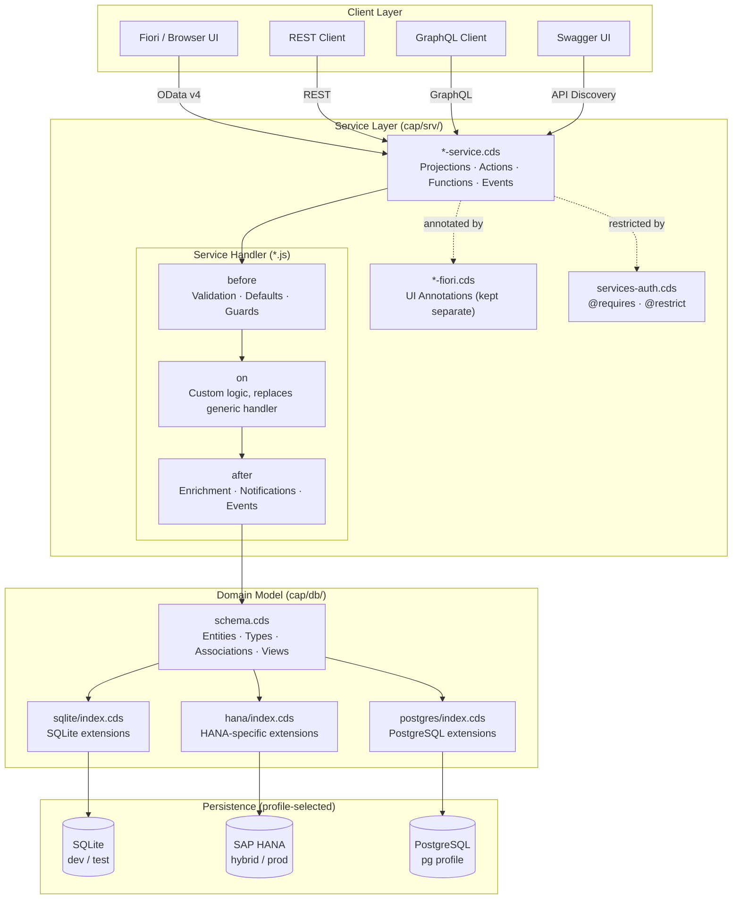

# CAP Architecture Overview

This document explains how the layers in this sample fit together.

## Request-to-Response Flow



## Layer Responsibilities

### Domain Model (`db/schema.cds`)

The domain model defines **what data looks like**, independent of how it is served.

Key CDS concepts demonstrated:
- **`entity`** — a persisted table with typed elements
- **`cuid`** — mixin that adds an auto-generated UUID primary key
- **`managed`** — mixin that adds `createdAt`, `createdBy`, `modifiedAt`, `modifiedBy`
- **`Association` / `Composition`** — relationships between entities
- **`@assert.range`** / **`@assert.format`** — built-in server-side validations
- **`@mandatory`** — not-null + presence check
- **`@PersonalData`** — GDPR annotation for data privacy auditing
- **`@cds.persistence.journal`** — opt-in schema change journal (migration safety)

```
db/schema.cds
  └── star.wars namespace
        ├── Film          (draft-enabled, episode_id enum)
        ├── People        (PersonalData annotations)
        ├── Planet
        ├── Species
        ├── Starship
        ├── Vehicles
        ├── Film2People   (M:N junction with @assert.unique)
        └── ... (other junctions + views)
```

### Service Layer (`srv/*-service.cds`)

Services **project** domain entities into API-facing views. The key insight:
- You can expose different shapes for different consumers
- You can make things read-only that are writable in the model
- You can add custom **actions** and **functions** beyond CRUD

```
srv/people-service.cds (StarWarsPeople service)
  ├── People          ← writable projection, @odata.draft.enabled
  ├── Film            ← @readonly projection
  ├── Planet          ← @readonly projection
  ├── ...
  ├── action rename() ← bound action on People
  └── function countByGender() ← unbound function
```

### Handler Lifecycle (`srv/*.js`)

Every mutable request passes through three phases in order:

| Phase | Purpose | Example |
|-------|---------|---------|
| `before` | Validate / guard / set defaults | Reject blank names, normalize input |
| `on` | Implement custom business logic | Custom action handlers |
| `after` | Enrich results / emit side effects | Compute `displayTitle`, fire events |

If **no `on` handler** is registered, CAP's generic provider handles CRUD automatically.
If **an `on` handler** IS registered, it fully replaces the generic handler — you own the response.

See [people-service.js](../srv/people-service.js) for all three phases in one file.

### Authorization (`srv/services-auth.cds`)

CAP authorization is annotation-driven. Two annotations work together:

| Annotation | Scope | Controls |
|-----------|-------|---------|
| `@requires` | Service, entity, action | Which roles may access at all |
| `@restrict` | Entity | Fine-grained grant/to/where per event |

The showcase defines three conceptual roles:
- **`Viewer`** — read-only access to all data
- **`Editor`** — can create/update People (the only writable entity in the showcase)
- **`Admin`** — full access including delete and admin actions

See [services-auth.cds](../srv/services-auth.cds) for the full matrix.

### Profile Extensions (`db/hana/`, `db/sqlite/`, `db/postgres/`)

CAP loads profile-specific CDS files on top of the base schema.
This is used for:
- DB-specific SQL functions or native types
- Overriding persistence behavior (e.g., `@cds.persistence.skip` for views on one DB)
- Adding calculated fields or indexes that only make sense on one backend

See [docs/profile-comparison.md](profile-comparison.md) for what each profile changes.

## Protocols

This service exposes **three protocols simultaneously** from the same model:

| Protocol | Path | Use case |
|---------|------|---------|
| OData v4 | `/odata/v4/<Service>/` | Fiori UI, standard SAP integration |
| REST | `/rest/<Service>/` | Simple HTTP clients, microservices |
| GraphQL | `/graphql/` | Flexible querying, developer tooling |

The `@protocol: ['odata-v4', 'graphql', 'rest']` annotation on each service enables all three.

## Event Flow

When a `People` record is created or updated, three things happen:

```
1. POST /odata/v4/StarWarsPeople/People
        │
        ▼
2. before CREATE  ─→ validate name is non-empty
        │
        ▼
3. on CREATE  ─→ (generic CRUD — no custom on-handler for this event)
        │
        ▼
4. after CREATE
        ├─→ alert.notify(...)     ← SAP Alert Notification
        └─→ this.emit('People.Changed.v1', data)  ← AsyncAPI domain event
```

The domain event `People.Changed.v1` is declared in the service CDS and appears in the AsyncAPI spec generated by `npm run asyncapi`.
